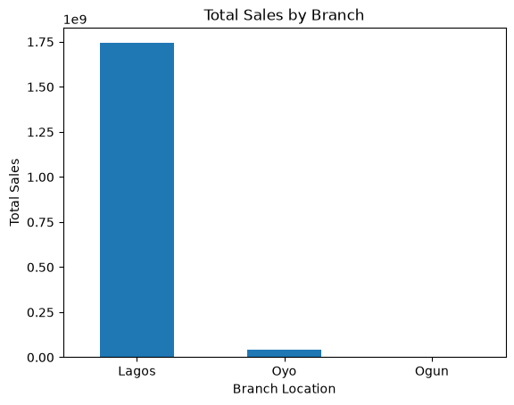
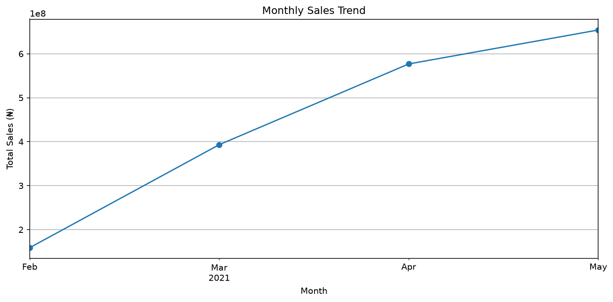

Nigerian E-commerce Sales Analysis

Project Overview

This project analyzes a Nigerian e-commerce sales dataset to evaluate sales performance, order trends, product performance, delivery outcomes, cancellations, and other business insights.

The analysis was conducted using Python, Pandas, Matplotlib, and Excel.

Objectives

The main objectives of this project were to:

- Analyze overall sales performance
- Identify sales and order trends over time
- Evaluate product performance
- Analyze order status and delivery outcomes
- Investigate order cancellations
- Compare sales performance across branches
- Generate actionable business insights and recommendations

Tools Used

- Python
- Pandas
- Matplotlib
- Excel
- Jupyter Notebook

Key Findings

- Total sales generated were approximately ₦1.78 billion.
- The dataset contained 2,406 orders.
- A total of 222,719 units were sold.
- The average order value was approximately ₦741,082.83.
- Lagos generated by far the highest sales compared with the other branches.
- Order cancellations represented a major business challenge and required further investigation.
- The top 10 products accounted for approximately 58.43% of total sales.
- Milo sachet 20g was among the leading products by sales.
- Monthly analysis revealed significant changes in order and cancellation patterns over the period studied.

Business Recommendations

1. Investigate order cancellations
   Management should identify the major causes of cancellations and develop strategies to reduce them.

2. Improve delivery operations
   Delivery performance should be monitored closely, particularly in locations with weaker delivery outcomes.

3. Focus on high-performing products
   Inventory planning and marketing efforts should prioritize products that contribute significantly to total sales.

4. Monitor monthly performance
   Sales, orders, cancellations, and delivery outcomes should be tracked monthly to identify emerging trends early.

5. Investigate underperforming products
   Products with low sales performance should be reviewed to determine whether pricing, demand, availability, or marketing is responsible.

Conclusion

This analysis demonstrates how data analytics can be used to transform Nigerian e-commerce sales data into meaningful business insights.

The project highlights important areas including sales performance, product concentration, order trends, delivery outcomes, and cancellations. These insights can help businesses improve operational efficiency, inventory management, customer experience, and overall sales performance.

Project Notebook

The complete analysis, including the Python code, calculations, and visualizations, is available in the Jupyter Notebook included in this repository.

## Sales by Branch

The analysis shows that Lagos generated the highest sales, significantly outperforming Oyo and Ogun.

Monthly Sales Trend

Monthly Sales Trend

This visualization shows how sales performance changed over the period analyzed, helping identify monthly patterns and potential areas for business improvement.

Key Business Insights

1. Lagos Dominates Sales Performance

Lagos generated approximately ₦1.74 billion in sales, significantly exceeding the sales recorded in Oyo and Ogun. This indicates that sales were heavily concentrated in Lagos during the period analyzed.

Business recommendation: Management should investigate the factors driving Lagos's performance and assess opportunities to improve sales in other branches.

2. Monthly Sales Performance Needs Monitoring

The monthly sales trend provides a view of how revenue changed between February and May 2021. Monitoring these changes can help management identify periods of strong or weak performance.

Business recommendation: The business should investigate the factors behind monthly revenue changes and use the findings to improve sales planning.

3. Order Cancellations Require Attention
The analysis found that 61.68% of unique orders contained at least one cancelled item (1,484 out of 2,406 orders). This metric identifies orders affected by cancellations; it does not necessarily mean that every item in those orders was cancelled.
The analysis identified a substantial number of cancelled orders. Cancellations can affect revenue realization, inventory planning, delivery costs, and customer experience.

Business recommendation: Management should investigate cancellation reasons, monitor cancellation rates, and develop strategies to reduce avoidable cancellations.

4. Sales Are Concentrated Among Top Products

Top 10 Products Insight: The top 10 products generated ₦1,041,871,689.00 in sales, representing 58.43% of total sales of ₦1,783,045,294.76. This indicates that a substantial share of revenue comes from a relatively small group of products.
Business recommendation: The business should monitor stock availability for high-performing products while exploring ways to improve the performance of other products.

Conclusion

This project demonstrates the use of Python, Pandas, and Matplotlib to analyze Nigerian e-commerce sales data and generate actionable business insights.

The analysis explored revenue performance, branch comparisons, monthly sales trends, product contributions, and order cancellations. The findings highlight opportunities to improve sales planning, inventory management, and order fulfillment.

Through this project, I applied data analysis techniques to a real-world business dataset and developed recommendations to support data-driven decision-making.

Skills Demonstrated

- Data cleaning and preparation
- Exploratory data analysis (EDA)
- Python and Pandas
- Data aggregation and KPI analysis
- Data visualization with Matplotlib
- Business insights and recommendations
- Communicating analytical findings

Author

Joel Dimkpa

- "GitHub" (https://github.com/clevoisaac-del)
- "LinkedIn" (https://www.linkedin.com/in/joel-dimkpa-8ba67a12b)
